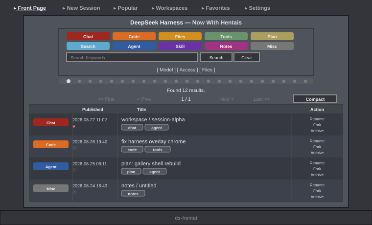

# ds-hentai

[English](README.md) | 简体中文

**ExHentai.org 皮肤** for DeepSeek Harness。深炭底、浅灰文字、灰色边框；会话列表像画廊索引，发送框像搜索栏。



## 安装

```sh
# 从 npm（预构建）
npx @deepseek-ai/dsh plugin --profile web add ds-hentai
# 或直接从 GitHub
npx @deepseek-ai/dsh plugin --profile web add github:<owner>/ds-hentai
```

重启 `dsh web` 后刷新页面。之后更新皮肤，刷新即可。

## 功能

- **顶部导航** —— Front Page、New Session、Popular、Workspaces、Favorites、Settings。
- **Front Page** —— 按类别筛选、搜索会话；列表可切换表格或缩略图。Compact / Extended 下每行有 Rename / Fork / Archive。
- **会话页** —— 对话仍是原来的内容；可选皮肤搜索坞（Search / Clear，以及 Model、Access、Agent、Effort、Commands、Files）或继续用原生输入框。
- **收藏** —— 列表里点心形，Favorites 只显示已收藏的会话。

## 设置

在 **Settings → General**，或顶部导航 **Settings** 里改。文案跟随宿主界面语言（`zh` / `en`）：

- **启用皮肤 / 系统外观** —— 总开关。关掉即回到切换前的 DSH 外观。
- **原生侧边栏** —— 会话页要不要显示左侧会话栏。隐藏后从 Front Page 点进会话。
- **对话输入框** —— 皮肤输入框和原生输入框二选一。
- **Front Page 显示模式** —— 会话列表怎么排。Front Page 底栏下拉也可以改。

| 模式 | 看到什么 |
| ---- | -------- |
| **Minimal** | 表格，不显示 tags |
| **Minimal+** | 表格，显示 tags |
| **Compact** | 表格，tags + Rename / Fork / Archive（默认） |
| **Extended** | 同 Compact |
| **Thumbnail** | 卡片网格 |

恢复内建外观：把总开关切到 **系统外观**。若设置打不开：

```sh
dsh plugin --profile web remove ds-hentai
dsh web
```

## 开发

```sh
npm install
npm run build      # src/client.js + src/skin.css → lib/client.js
npm run check      # 校验 bundle 信封/占位符/无 ESM import/大小预算
npm test           # build + check
npm pack --dry-run # 发布视图关门
```

## 目录

- `src/client.js` —— 插件主体（`THEME`、`apply` 状态机、设置行、`shell.overlay` 画廊壳）
- `src/skin.css` —— 作用域装饰 + 布局重建
- `scripts/build-client.mjs` —— 组装 `window.__ModuleLoader__.load(...)` 信封到 `lib/client.js`
- `docs/ARCHITECTURE.md` —— 运行时数据流与边界
- `docs/COMPATIBILITY.md` —— 基线、分层稳定性、恢复方式

## 说明

纯浏览器端插件，不改 DSH 文件。会话、回复和设置仍走 DeepSeek Harness；皮肤只换壳。偏好存在本机浏览器里。需要较新的 DSH Web GUI（`0.1.0-rc.6` 及带 `shell.overlay` 的 ui-layout）；更旧的版本可能只剩下配色和 General 里的开关。详见 [docs/COMPATIBILITY.md](docs/COMPATIBILITY.md)。

## License

[MIT](LICENSE)
